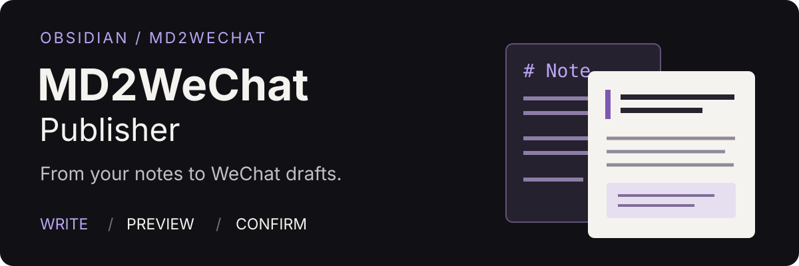

# MD2WeChat Publisher 2.1

<p align="center">
  
</p>

在 Obsidian 写文章，交给 Agent 排版，在笔记旁预览，确认后创建微信公众号草稿。

[下载安装](#下载和安装) · [第一次使用](docs/FIRST-RUN.md) · [连接创作助手](#连接创作助手与生图) · [更新日志](CHANGELOG.md)

**桌面端 Obsidian 1.12.7+** · **手动安装** · **AGPL-3.0-only**

2.1 基于 [md2wechat](https://github.com/geekjourneyx/md2wechat-skill)。在面板中主动连接 Claude Code 或 Codex，选择基础排版、智能增强、标题候选、润色、封面与正文配图。所有修改只进入公众号成稿，原始笔记保持不变。

当前为 2.1.0 发布准备版本，主要真实宿主流程与本地安装包已检查，尚未发布。具体已测与未测范围见[宿主验收记录](docs/verification/creation-host.md)；在线安装包以 Release 页面实际版本为准。

## 它能帮你做什么

- **写作与预览放在一起**：在笔记旁查看公众号成稿，调整主题与字号。
- **主动选择自己的助手**：连接 Claude Code 或 Codex，生成少量合适的增强、标题与润色候选。
- **保留已选成果**：标题、封面和图片按文章保存，换一批或刷新不丢失已经采用的内容。
- **确认后再创建草稿**：自动带入已选标题与封面，最后核对确认；原始笔记不变。

## 先安装 md2wechat

在终端依次运行，按配置向导完成配置：

```sh
npm install -g @geekjourneyx/md2wechat
md2wechat version --json
md2wechat config init --json
md2wechat config validate --json
```

本版本以 md2wechat 3.5.0 验证。配置校验通过后，再安装插件。公众号账号和排版服务的配置方法见 [md2wechat 项目说明](https://github.com/geekjourneyx/md2wechat-skill)。已有配置的用户先检查版本并校验，不必重复初始化。

## 下载和安装

1. 下载 [最新 Release](https://github.com/geekjourneyx/obsidian-md2wechat/releases/latest) 中的 `md2wechat-publisher-<版本号>.zip`（2.1.0 尚未发布，勿将旧版下载误认为本轮版本），不要下载 GitHub 自动生成的 Source code。
2. 解压，把其中的 **md2wechat-publisher** 文件夹放进笔记库的 `.obsidian/plugins/`。
3. 重启 Obsidian，在“设置 → 第三方插件”启用 **MD2WeChat Publisher**。

需要桌面 Obsidian 1.12.7+。安装后路径应为 `.obsidian/plugins/md2wechat-publisher/main.js`，不要多套一层目录。当前提供手动安装包，插件市场审核将另行提交。

[完整安装与旧版升级说明](INSTALL.md) · [第一次使用](docs/FIRST-RUN.md)

## 排版到草稿箱

1. 打开文章和“公众号排版”面板；不使用助手也可先预览当前文章。
2. 如需创作功能，主动连接 Claude Code 或 Codex，再选择基础排版或智能增强。增强只选择适合正文的少量展示方式。
3. 查看候选与变化，再采用；需要时润色全文或调整段落展示。原文始终不变。
4. 生成标题或封面候选，查看批次并选中一个。选择会保存为本篇发布资料；换一批不取消原有选择。正文配图另行选择插入段落，再确认插入。
5. 查看发布前检查，点击“创建草稿”，核对账号、标题、封面等信息，最后确认。

修改原文后会提示“原文已更新”，旧成稿保留；重新排版并采用后才能继续创建草稿。刷新预览、采用成稿与创建草稿是独立操作，不会自动更新微信后台旧草稿。

最终确认前不上传微信。创建结果不确定时先核对公众号草稿箱，不能反复创建。创建记录仅表示本插件曾经完成的操作，不代表微信后台实时状态。插件不自动正式发布文章。

## 连接创作助手与生图

插件可发现本机已安装的 Claude Code 和 Codex，由用户主动选择；不会预选或自动切换。两者需要各自已有可用登录或运行环境。文字可用不代表生图可用；图片仅复用 md2wechat 已配置的火山生图服务，不在插件中新增密钥设置。

每次封面或正文配图生成 2 张，可能向服务发送文章或所选段落并产生费用；只在点击生成后开始，不自动付费重试。成功的图片保留，采用后按 Obsidian 附件位置保存。封面不会自动插入正文，正文配图不改动原始笔记。

图片生成前可选择“图片风格”，并查看对应说明。正文配图提供全部可用风格，信息图排在前面；封面提供适合封面的方案，也包括兼容封面的苹果发布会、暗黑票券和复古版画风格。选择会记住，实际生成使用所选方案。本机 md2wechat 3.5.0 当前发现 25 种正文配图风格和 14 种封面风格，后续以工具返回的列表为准。信息图可使用原段落已有文字，不应增加原文没有的事实或数据。

插件直接启动 CLI，继承 Obsidian 进程环境，不自动执行终端函数或加载 shell 配置。终端中能用的自定义函数不一定能被桌面 Obsidian 使用，连接测试结果以插件内实际返回为准。

外部 Agent 仍可通过官方 Obsidian 命令行与包内技能接入；这条外部方式需要支持该命令行的安装程序。插件内连接 Claude Code/Codex 不依赖 Obsidian 官方命令行。

[Agent 技能说明](skills/obsidian-md2wechat/SKILL.md) · [兼容范围](docs/AGENT-COMPATIBILITY.md)

## 验证范围

本次在 macOS / Obsidian 1.13.7 完成真实 Codex 连接、智能增强候选与采用、两批标题选择保留、文章切换、重载恢复、封面选择与裁剪、既有正文图片插入、刷新及换主题保留图片、润色前后预览比较、采用与撤回、发布前检查和创建窗口资料核对。已查看内置浅/深色和约 288、480 像素侧栏。

封面界面验收使用先前真实生图得到的图片，并非在该轮界面中再次付费生成；正文配图验收使用既有图片。本轮未创建真实微信草稿。完整精确尺寸、大字号、第三方主题及全部附件位置尚无完整宿主结论；Windows、Linux 未实测，移动端不支持。2.0 的历史记录不能代替新版验收。

[宿主验收](docs/verification/creation-host.md) · [文字验证](docs/verification/creation-agent.md) · [图片验证](docs/verification/creation-image.md)

## 常见问题

**刷新排版会更新微信后台的旧草稿吗？**

不会。刷新只更新本地预览；“创建新版草稿”会新增一篇，并再次要求确认。插件不会自动正式发布文章。

**创建结果不确定，可以再点一次吗？**

请先核对公众号草稿箱，不要盲目重试。本地成功记录不代表草稿在微信后台仍然存在，后台修改也不会反向同步。

**插件里需要填写 API Key 吗？**

不需要。账号和排版服务由 md2wechat 配置管理，插件不直接提供接口与密钥设置。

## 开发与贡献

```sh
npm ci
npm run check
npm run package
```

检查需要本机已安装 md2wechat。打包结果在 `artifacts/release/`。推送与版本号一致的标签（例如 `v2.1.0`）后，GitHub Actions 自动检查、打包并上传 ZIP、三个插件文件和校验文件到 Release。

[开发指南](dev.md) · [发布流程](RELEASE.md) · [更新日志](CHANGELOG.md) · [验收记录](https://github.com/geekjourneyx/obsidian-md2wechat/blob/main/docs/verification/experience-matrix.md)

反馈问题请提交 [Issue](https://github.com/geekjourneyx/obsidian-md2wechat/issues)，附上插件与 Obsidian 版本、操作系统、复现步骤和脱敏截图。提交代码前请阅读 [协作约定](AGENTS.md)，并运行上述检查。

## 许可证

本项目采用 [GNU Affero General Public License v3.0](LICENSE)。
