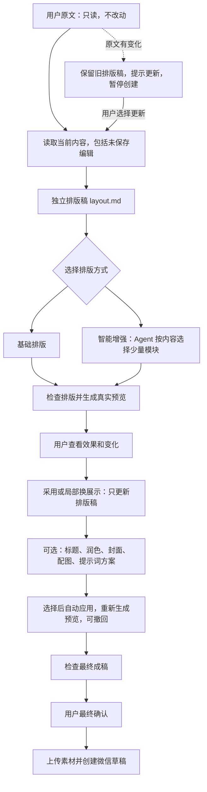
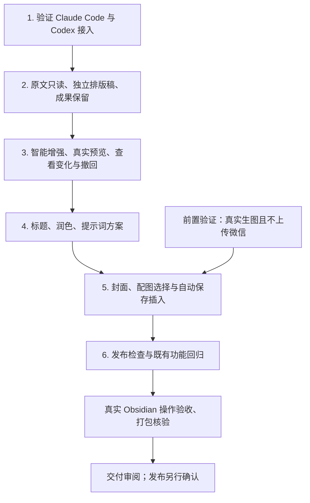

# 公众号创作升级：版本范围、开发顺序与验收计划

状态：本轮收敛范围已实施，完整自动检查、主要真实宿主流程和本地安装包核验已完成；尚未发布。版本号以最终打包核验为准。本文件保留最初验收目标，下方清单区分已完成项目和仍待完整验证项目，不能把代码已实现等同于全部体验已验收。

## 目标与范围

用户在 Obsidian 写文章，选择创作方案和候选成果，插件自动完成采用、图片保存、插入、预览与发布前检查；最终由用户确认创建微信草稿。

本版范围：Claude Code 与 Codex 两种自主接入、基础排版与智能增强排版（本版核心亮点）、标题候选、润色比较、封面与正文配图候选及自动采用、提示词方案选择、资源管理、发布前检查。每项能力必须实测；不能以隐藏不可用按钮代替完成已承诺的功能。

不依赖 Claudian，仅参考其多工具接入代码。无聊天窗口、会话管理产品、工具市场、通用工作流引擎、拖拽排版画布或自动正式发布。暂不扩展第三种 AI 工具。

## 已确认事实与前置障碍

- 本机 md2wechat 为 3.5.0。advise 可独立提出有限建议；title suggest 和图片 plan 只生成待执行请求，不代表已有标题或图片。
- 普通 CLI 生图路径可能上传微信，当前不能直接作为预览前生图路径。先验证受支持的仅本地生成路径；若 CLI 不支持，验证所选 AI 实际提供的本地生图工具。不得绕过最终确认前不上传的约束，不修改 md2wechat 仓库。
- Claude Code、Codex 能接受外部任务，不代表本插件接入、认证、取消、错误恢复或生图已验证。
- Claudian 本地代码参考位置：src/providers/claude、src/providers/codex；不引用其私有运行对象，不复制整套应用。
- 现有刷新排版会读取最新原文；新版本不能因此丢弃已选标题、封面和局部成果。

## 必须遵循的行为

- 自动发现已安装 AI，用户主动选择一次；不自动选用或切换。执行时更新 AGENTS.md 中旧的“不自动探测”条款，注明本轮用户决定。
- md2wechat 既有配置先检查，不重新初始化、不迁移密钥。缺失安装、登录、配置分别呈现可操作指引，不声称完全零安装。
- 无 AI 时保留普通预览和既有发布流程。文字可用与生图可用分开判断。
- 用户原始 Markdown 严格只读，本版不提供写回原文。读取含未保存编辑的文章快照，在每篇文章、每次任务独立工作目录生成 layout.md；Agent 仅编辑此排版稿。标题、封面选择另存为本篇发布资料，润色、模块与正文配图只进入排版稿。正文预览明确提示“仅调整公众号成稿，原文不变”，不暴露工作文件名称。
- 排版稿虽在工作目录，但已采用版本是需保留的创作成果，不属于可随时清除的临时文件；关闭重开可以继续。待生成或未采用版本不得原地覆盖已采用版本。
- 原文变更提示“原文已更新”，旧排版稿保留供比较，暂停创建草稿。用户选择更新后生成新的 layout.md，经检查和采用后恢复创建；失败保留旧稿，不自动把旧模块套到新段落。过期任务不能替换新结果。
- Agent 返回的排版稿须通过真实 md2wechat 模块验证与预览；插件确认输出属于本次文章及版本、图片可解析且预览成功，才提供采用。发布使用已确认预览对应的排版稿、图片和发布资料，不临时另做一份稿件。
- 标题作为发布标题采用，正文标题的显示独立明确；封面不自动变正文插图；每篇文章独立保存选择。
- 标题和封面均支持批量生成、查看候选、换一批、选中其中一个。选择即保存为本篇发布资料，不额外要求一次“采用”确认；创建草稿时自动带入，最终确认窗口允许更换。标题不写回原文，封面不自动插入正文。
- “换一批”只新增候选，不取消或覆盖当前选择，不自动选中首项；以前批次可回看。首次未选标题时沿用原有文章标题，未选封面时使用既有手动选择流程。封面选中后先可靠保存到附件位置再更新选择，保存失败保留原选择。
- 批量封面展示真实完成结果；部分失败保留成功图片及当前选择，不整批重试。生成前说明数量及可能产生的费用，不编造金额；换一批是用户主动发起的新生成，不后台自动循环。批次数量依据真实服务能力和耗时确定，不预先承诺任意数量。
- 标题与封面点击选择即保存，放大查看图片不等于选择；排版、润色和正文配图仍是预览后明确采用或插入。再次生成不清空既有候选。润色可比较、可分项采用、可撤回。
- 图片保存遵循 Obsidian 附件设置；已采用图片为笔记库普通文件。已有素材不移动、不复制；未采用候选与临时处理文件分开保存。
- 持久记录使用笔记库相对位置，正文链接遵循 Obsidian 链接设置，调用 CLI 时换算绝对路径。重名不覆盖、移动重命名后更新记录；找不到素材不能猜同名文件。
- 撤回插入不自动删除可能被其他文章引用的图片。清理不能删除已采用或仍被引用资源。
- 发布检查区分创建条件和编辑建议，不承诺通过微信内容审核；检查与图片生成不创建草稿。最终确认前不上传微信。
- 生图可能向服务发送内容并产生费用，应在首次使用和重新生成操作中清晰说明，禁止后台自行反复付费重试。
- 草稿创建结果不确定时禁止盲目重试；记录按文章、账号、版本区分，不能描述为微信后台实时状态。

## 界面基线

Obsidian 原生控件与主题；借鉴苹果的清晰、克制、直接操作和可逆反馈。操作界面随宿主主题，文章预览保持实际公众号样式。

顶部保留文章身份与少量固定入口，创建草稿固定可找；不预设常驻底栏。正文占主要空间，一个主要滚动区。标题/封面有对应操作入口；完善菜单作为同名功能的可发现入口。图片/标题候选使用原生弹窗，窄时单列。

一处交互面只有一个主要强调按钮；需要采用确认的弹窗取消在左、采用在右。标题与封面使用单选候选，清晰标注“已选”，选择后自动保存，不再叠加采用按钮；换一批与当前选择分开，允许回看之前批次。少用纯图标按钮。候选必须能用键盘选择，选中状态不只靠颜色；焦点可见，弹窗关闭恢复焦点，错误原位说明并保留成果。

间距基线为 4/8/16/24 像素，左右留白通常 16、窄时 12；按钮遵循原生尺寸，避免固定高度裁掉大字号。以上是起点而非官方强制尺寸。实际宿主检查后统一调整，不叠加多组覆盖规则。不新增字体、渐变、装饰卡片和无用途动画。

## 开发顺序与每段交付

更新说明（2026-09-12）：本轮已进入实施后验收阶段。勾选表示该条所述范围已有明确证据；未勾选可能是完整宿主流程仍在验证，也可能包含当前界面尚未覆盖的细节。原规划中的直接跳转正文和通用高级提示词编辑器已移出本轮收敛交付范围，当前采用段落选择与候选对照；保留原条目用于追踪未来方向，不表示当前运行受阻。当前可用增强限定为重点提示、重点摘录、编号步骤、检查清单和对比展示五类，按段落实际适用范围提供；图片仅支持已有 md2wechat 火山生图配置，不宣称支持其他供应商。

### 1. 验证接入与生图可行性

涉及：新建 src/agent/ 下最少的连接、任务执行与两种工具实现；参考 Claudian 代码但不新增其依赖。

- [ ] 分别验证两个工具的可用检测、已有登录复用、短任务结果、停止、失败信息和输出文件读取。已完成独立进程中的真实 Codex / Claude 任务；Claude 使用用户现有 zhipu 环境。宿主中已完成 Codex 连接，不能据此勾选两个工具的完整宿主流程。
- [ ] 检查独立文章工作目录、权限边界及插件停用后任务收尾，不复用用户正在进行的其他任务。
- [x] 验证至少一条不上传微信的真实生图路径，记录执行环境与能力限制；不存在则停止生图实现承诺并明确外部障碍，不伪造候选。
- [x] 保存去敏的真实结果及复现说明至 docs/verification；未通过之前不铺开整个 UI 或扩展工具数量。

### 2. 打通独立排版稿与智能增强（核心交付）

涉及：main.ts、settings.ts、view.ts、styles.css、src/results/result-store.ts、src/preview/prepare-preview.ts，以及按需拆分的 src/ui/ 创作操作。

- [ ] 先覆盖文章切换、过期结果、取消与原文变更的失败场景，再完成任务与文章绑定。
- [ ] 从编辑器快照生成独立 layout.md；实现候选/已采用版本与原文关联，所有编辑操作禁止写回源文件。内部 formatted.md 与 layout.md 的现有约定统一调整或明确转换，同步技能与测试，不保留两个含义不清的成稿来源。
- [x] 排版入口提供“基础排版”和“智能增强”：前者仅常规样式，后者允许 Agent 选用少量合适模块；不强迫每篇文章增强。
- [ ] Agent 先发现 CLI 的模块说明和限制，根据真实原文选择步骤、对比、重点摘录、提醒等已验证模块；不捏造内容、不遗漏原文，不凑数量。默认先增强两三处以内，短文可零增强。
- [ ] 基础排版和智能增强默认保留措辞；需要改写才能成立的模块单独提出润色建议。模块语法检查不能代替实际渲染验证，未正常渲染的候选不得标为成功。
- [ ] 提供“查看变化”与跳转到增强处（目前已实现变化列表、候选对照和逐处改换/恢复；直接跳转正文位置属于本轮范围外的未来方向）；显示真实增强摘要，只有确认措辞未变时才能声称“正文措辞未改”。标记和按钮属于操作界面，不进入发布正文。
- [ ] 每处增强提供“换一种展示”“恢复普通段落”；只给当前内容适合的少量实际效果，选择候选不改变已采用稿，采用后刷新并可撤回。也支持用户选中段落后“改善这里的展示”。
- [ ] 开始排版、展示候选、采用、局部调整、撤回、关闭重开恢复成果形成完整流程；改变原文后旧成稿保留但禁止继续创建草稿。
- [x] 用户不接触指令或中间文件；状态由实际任务事件驱动，不伪造进度百分比。
- [ ] 在真实 Obsidian 内验证界面基线再继续扩展。

### 3. 标题、润色与创作方案

涉及：src/cli/catalog-service.ts、src/cli/contracts.ts、src/agent/、src/ui/ 下候选选择和润色比较、src/results/result-store.ts。

- [ ] 从实际 CLI 发现提示词方案，提供用途说明；高级查看/编辑只在展开后出现，不另造提示词商城。当前封面从真实 CLI 读取方案，标题提供吸引力选择，润色提供方向和补充要求；通用高级提示词编辑器属于本轮收敛范围外的未来方向。
- [x] 标题批量生成、换一批、回看批次、单选保存、重开恢复；换批不清空已选标题，创建草稿自动带入所选标题，不意外改正文首标题。上述流程已实现并有针对性自动检查；真实宿主已生成两批、每批 10 个标题；第一批选中后换批再返回仍已选，重载保留，最终窗口自动带入已选标题。
- [ ] 润色分原文与结果比较，采用与撤回；默认保留事实和作者意图，不能包装成事实核验。
- [ ] 再次生成、切换方案、失败和过期返回不清空已采用结果。

### 4. 封面与配图自动采用

涉及：src/source/ 下资源保存与定位、src/results/result-store.ts、src/ui/publish-modal.ts、src/publish/asset-bindings.ts，以及候选选择界面。

- [ ] 封面批量生成、换一批、回看批次、放大查看、单选保存及裁剪形成完整流程（已实现，含方形和横版裁剪；真实宿主全流程仍待完成）；所选封面在创建草稿时自动带入，不要求重新找文件。正文配图仍单独确认插入位置；已选段落可直接作为插入位置。
- [ ] 验证批量生图部分失败、换批失败、保存失败、连续换批与任务晚返回：保留已选封面及成功候选，不重复收费重试、不串文章。
- [x] 插入定位基于发起时文章版本和段落；正文已变不能继续沿用旧位置自动插入。
- [ ] 采用后保存至附件目录，再更新引用；保存失败不生成断链。重复采用不重复插图。
- [ ] 验证中文空格文件名、同名图片、不同附件设置、移动重命名、缺失素材、撤回及候选清理。
- [ ] 验证取消/生图失败只影响相应图片，正文与其他成果仍可用。

### 5. 发布检查及旧流程回归

涉及：src/cli/preview-service.ts、src/ui/publish-modal.ts、src/publish/draft-service.ts、现有测试与 docs/verification。

- [ ] 检查同一份最终成稿的账号、标题、封面、图片和版本；需要重排时保留已有成果。
- [ ] 内容建议和创建阻碍分组；可修复问题明确改动，修复后重新检查。
- [ ] 用替代微信服务验证最终确认前零上传、确定失败与不确定结果的不同处理、重复点击和账号版本区分。
- [x] 真实草稿创建只有得到明确授权后执行；未执行必须在验收记录标明，不自动正式发布。

### 6. 打包与发布准备

- [ ] 每项行为修改以代表性失败用例开始，最小实现后通过对应测试；各完整阶段及交付前运行 npm run check。最新完整检查 139 项通过、1 项需主动开启的测试跳过；真实五类模块检查另行运行并通过。
- [ ] 完成下方宿主与用户任务验收。先修复发现的问题再复验，不以截图或自动测试代替真实操作。
- [ ] 更新 README、INSTALL、RELEASE、CHANGELOG、首次使用、Agent 技能和兼容说明；旧方案标历史。
- [ ] 确认版本后同步 package.json、package-lock.json、manifest.json、versions.json，保留 md2wechat-publisher ID。
- [x] npm run package；检查 ZIP 包含三个插件文件与配套技能，不含 data.json、凭证、用户文章、生成候选或本地测试资料。本地 ZIP 为 16 个条目、127,255 字节，尚未发布。
- [ ] 发布动作单独授权；发布后下载实际 ZIP 再核验。插件市场提交不在本版内。

## 验收矩阵

| 场景 | 通过条件 |
| --- | --- |
| 首次连接 | 缺工具、未登录、版本不适用均有明确下一步；不要求手填路径作为默认流程 |
| 两个 AI | Claude Code 与 Codex 分别完成真实排版和局部调整；生图单独声明实测能力 |
| 原文保护 | 排版、润色、配图、采用、撤回及失败路径均不写原文；未保存编辑纳入快照但不强制保存；限制 Agent 写入范围并实际验证 |
| 智能增强 | 教程可整理步骤，对比有原文依据，短文可不增强；无事实新增、内容遗漏及非预期重复；真实预览正确 |
| 增强可感知 | 用户无需认识模块名称，即可查看变化、跳转、换展示、恢复普通段落；操作标记不进入发布正文 |
| 原文更新 | 提示更新、旧稿可查看、暂停创建；新稿成功并采用前不覆盖旧成果 |
| 文章隔离 | 两篇文章交替操作、任务晚返回、关闭重开不串内容 |
| 成果保留 | 已选标题、封面、图片、润色在重试和刷新时不无声丢失 |
| 标题与封面批次 | 批量生成、换批、回看、单选与关闭重开均正常；换批保留已选；创建草稿自动带入；预览图片不误选 |
| 选择与撤回 | 标题/封面选择仅更新发布资料；排版/润色/正文配图预览不改成稿，采用后生效，撤回恢复正确版本 |
| 资源 | 四种 Obsidian 附件位置、中文空格、同名、移动重命名与缺图均有明确结果 |
| 发布边界 | 检查/预览/生图零微信上传；最终确认才创建；未知结果不自动重试 |
| 宿主界面 | 默认浅色/深色及用户当前主题；320/360/480/720 像素面板、长标题、大字号、键盘操作、错误和空状态无截断或横向溢出 |
| 操作任务 | 已配置用户无需终端、复制指令或找文件，完成排版、标题选择、封面选择、配图插入及发布检查 |
| 包与兼容 | npm run check 通过、安装包实际检查；系统和工具版本只声明实际测过的范围 |

开发者操作验收不等于真实新手可用性研究。有新手试用时记录独立完成情况和卡点；没有时明确限制，不编造满意度或体验评分。

## 审校图：用户流程

图中可选创作操作也可以随时进入，不是强制向导。正文修改生成独立候选，失败不替换已采用成果；标题和封面通过批量候选单选直接保存为发布资料，创建草稿自动带入。流程不包含正式发布文章。

## 审校图：开发顺序

生图前置检查可以与文字能力验证分别推进；其失败不阻止原文保护和排版开发，但必须如实报告生图阻碍，不把未实现生图计为完整版本交付。

## 当前完成情况

本轮收敛范围已实施：助手连接、基础排版与五类智能增强、独立成稿、候选采用与撤回、标题候选、润色比较、封面候选与裁剪、正文配图、候选持久保存、改名关联和发布前检查。标题/封面作为独立发布资料保存；刷新保留已采用内容，从原文重新排版须先查看候选。用户原文只读。直接跳转正文、通用高级提示词编辑器属于未来方向；当前使用段落选择和候选对照，不将这些未来方向当作本轮运行阻碍。

实际 macOS / Obsidian 1.13.7 主要流程已经验证：Codex 连接；两次真实增强任务，首次发现并修复提示模块缺字段后取消，复验步骤、提示、对比与既有图片后采用；生成期间切换文章未串稿；两批各 10 个标题、跨批回看和选择保留；重载后标题、封面、配图及增强保留。真实润色候选前后均可查看排版预览，采用后撤回恢复原措辞，既有图片和增强保持。第一篇原文摘要未变，第二篇未改动。

封面候选来自先前真实生成文件，通过生产保存方法注入测试候选，并非本轮界面生成两张封面；已实际选择、保存到 `./资源`、方形裁剪另存并选中。正文界面选择既有验收图插入后，刷新和切换 Apple 主题仍保留。创建窗口自动带入标题及裁剪封面，发布前检查实际通过，未点击最终确认。真实目录显示封面 14 项、正文配图 25 项，方案选择保存已核对，无再次付费生图。

内置浅/深色、约 288 和 480 像素侧栏已经查看；没有据此宣称完整尺寸矩阵通过。宿主大字号、第三方主题、全部附件位置，以及 Windows/Linux/移动端、真实微信创建和初学者研究均未完成验证。

最新完整自动检查为 139 项通过、1 项主动开启项跳过；真实五类模块另行检查通过。本地安装包已核验：16 个条目、127,255 字节，必需文件完整，无 data.json 和测试资料；没有发布软件版本。

证据与边界：

- [真实宿主验收](../../verification/creation-host.md)：完整操作结果、原文摘要、安装包和未验证范围。
- [创作助手验证](../../verification/creation-agent.md)：Codex 与用户现有 zhipu 环境下 Claude 的独立真实任务；不等同于 Claude 全部宿主流程已验证。
- [本地图片生成验证](../../verification/creation-image.md)：现有火山配置下真实本地图片生成与检查；不上传微信，当前不支持其他供应商。

未创建真实微信草稿，未正式发布文章，未发布软件版本。发布后的下载核验尚不适用。已有 local-tests/ 未跟踪内容不属于本计划改动，不清理或打包其中资料。
